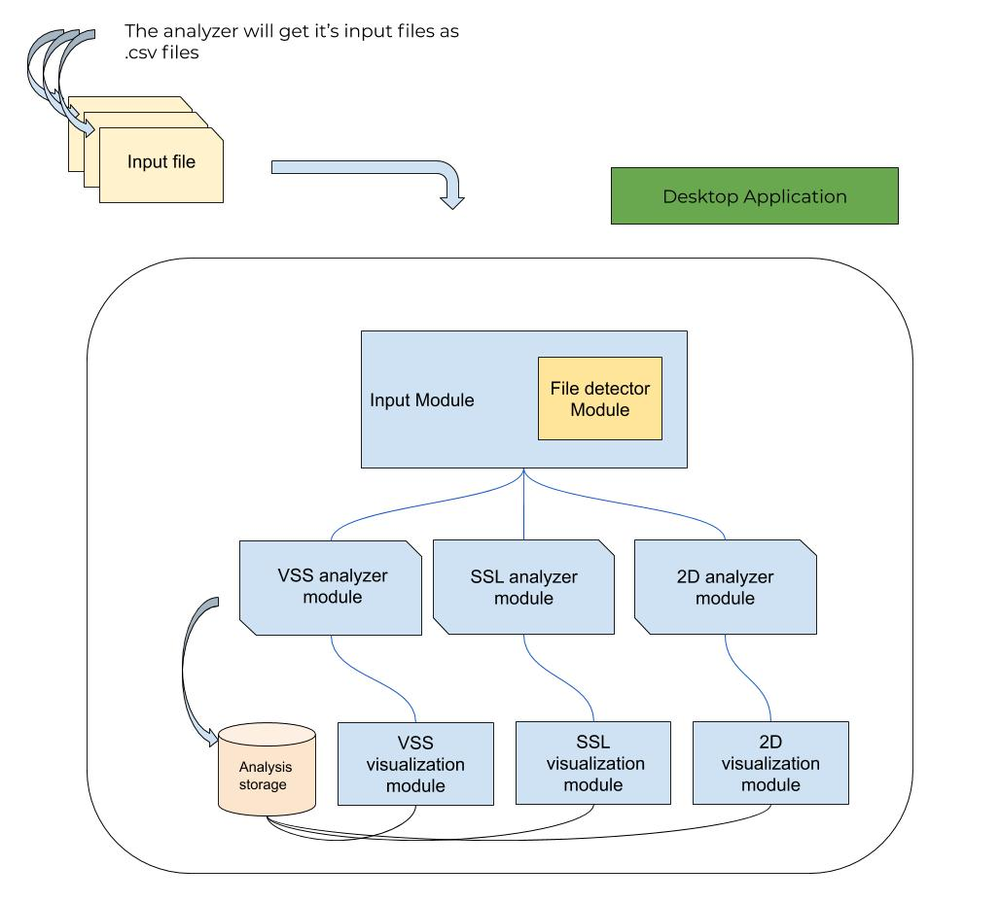
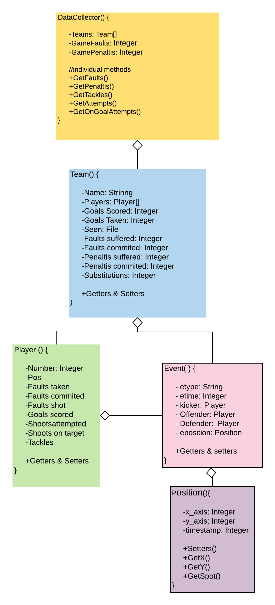

## RoboCIn - 2D Log Analyzer
### Install
You must have at least Python 3.x to run the analyzer and it's modules, if you don't have it, install it in your OS. More information here: https://www.python.org/downloads/

> The following modules are required:
>  - [PyQT5](#pyqt5)
>  - [Matplotlib](#matplotlib)
>  - [Pandas](#pandas)
>  - [Seaborn](#seaborn)

We are using pip3 to install these components, to check if you have it run:
```
pip3 -v 
```
If you don't have it run: 
```
sudo apt-get -y install python3-pip
```
If you are having problems with your pip3 setuptools, try:
```
pip3 install --upgrade pip3 setuptools
```
### PyQT5
PyQt5 the framework used to create our Graphical User interface(GUI). Our analyzer uses the Python version to create windows, pop ups, widgets and show all computed information on the screen. You should install it using:
```
pip3 install PyQt5
```
### Matplotlib
It's used to plot all information gathered from our DataFrames inside our main window. You should install it using:
```
pip3 install matplotlib
```
### Pandas
Is the main library to manipulate and explore our data. We use it to read the inputs as .csv files and then store information in our internal components described at (). You should install it using:
```
pip3 install pandas
```
### Seaborn
It's used to create plots that aren't possible only with matplotlib. Install it using:
```
pip3 install seaborn
```
- Arquitetura (V1)



- Diagrama de classes (V1.1)



- Generalização de campos/atributos

> Ter características principais comum a todas as categorias na qual se possa fazer análise.
> - Mapa de calor
> - Posição da bola
>  - Porcentagem de tempo em cada campo
>  - Porcentagem de cada estado de jogo
>  - Distância percorrida de cada jogador
>  - Posse de bola


# Catálogo de dados: SSL
> #### Estatísticas de chutes:
> - Chutes a gol.
> - Chutes no alvo.
> - Chutes desviados.
>
> #### Estatísticas passes:
> - Passes tentados.
> - Passes certos.
> - Passes desviados.
> - Velocidade média dos passes.
>
> #### Estado dos passes:
> - Estado inicial/Estado final
  

# Catálogo de dados: VSS

> #### Estatísticas de jogo:
> - Gols (Feitos/sofridos)
> - Faltas (cometidas/sofridas)
> - Pênaltis (cometidos/sofridos)
> - Tiros de meta.
> - Tempo de bola nas laterais do campo.
> - % do tempo em defesa e em ataque.
> #### Estatísticas de jogadores
> - Δx, Δy de posição esperada e posição real.
> - Δv de velocidade esperada e velocidade real do robô.

# Catálogo de dados: 2D

> #### Estatísticas de jogo:
> - % das faltas (cometidas/sofridas)
> - Posições das faltas.
> - Pênaltis (cometidos/sofridos)
> - Variação de playmodes entre binários.
> #### Estatísticas de chutes:
> - Chutes a gol.
> - Chutes no alvo.
> - Chutes desviados.
> #### Estatísticas de jogadores:
> - Variação do desempenho em função da stamina.
> - Ranking de gols, faltas, chutes, interceptações.
> - Posições de tackles.
	
